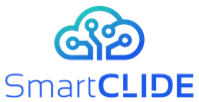


    

Join us for the launch of Open Research Webinars on Tuesday, December 15, 2020 at 16:00 CET. 

Through a selection of state-of-the-art project presentations and demonstrations, this new series of webinars introduces software research projects that help shape the future of open source software and the IT industry. Co-organized by OW2 and the Eclipse Foundation, the webinars will focus on international partners leveraging open source in European publicly-funded collaborative research and innovation programs.
   




## Presented Research Projects



   
      

      
      
      
      

      
   

  


  



  




## Co-organized by: 






  
  



  

 


  
  





